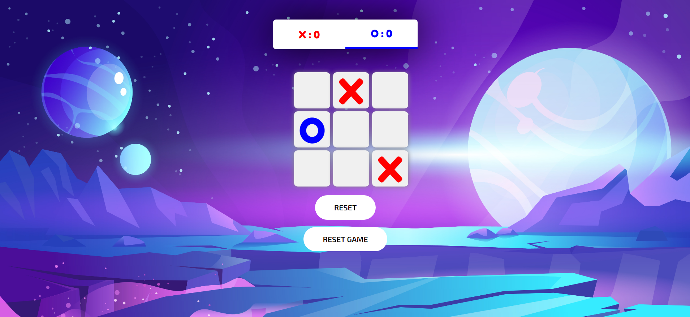

# Tic-Tac-Toe-with-React

This repository contains a simple yet interactive Tic-Tac-Toe game built using React.js.

**Project Overview:**
This repository contains a simple yet interactive Tic-Tac-Toe game built using React.js.

#### The picture of Project

**Key Features:**
- Play Tic-Tac-Toe against another player.
- Responsive design for desktop and mobile.
- Real-time game updates.

**Technologies Used:**
- React.js
- CSS

**Getting Started:**
To play the game locally, clone this repository, install dependencies with `npm install`, and run `npm start`.

**Demo:**
Try the game online at [Demo Link](https://jasserba.github.io/Tic-Tac-Toe-with-React).

**Contributing:**
We welcome contributions! Please see our [Contribution Guidelines](CONTRIBUTING.md) for details.

## License

This project is licensed under the MIT License - see the [LICENSE](LICENSE) file for the full license text.

**MIT License**

Copyright (c) [2023] [Ben Abdallah Jasser]

**Contact:**
Feel free to reach out with any questions or feedback at [benabdallahjasserr@gmail.com].
